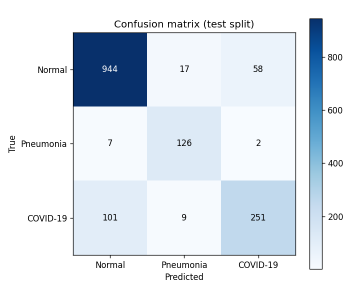
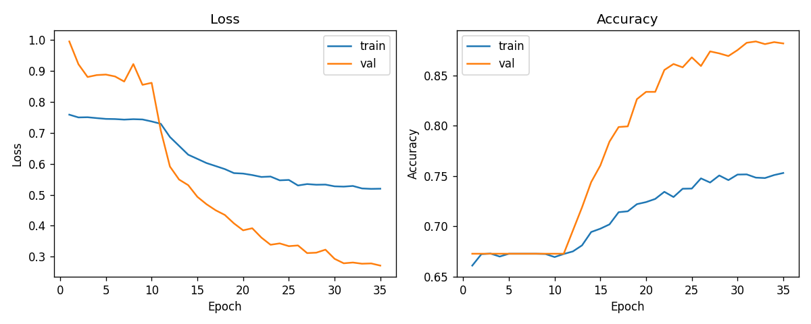

# Reporte de evaluacion del clasificador de radiografias

**Version del modelo:** `v1.0-20260516-192647`

## 1. Resumen de metricas (split de test)

- **Accuracy global:** 0.8719
- **Macro-F1:** 0.8456

| Clase | Precision | Recall | F1 | Soporte |
|-------|-----------|--------|-----|---------|
| Normal | 0.8973 | **0.9264** | 0.9116 | 1019 |
| Pneumonia | 0.8289 | **0.9333** | 0.8780 | 135 |
| COVID-19 | 0.8071 | **0.6953** | 0.7470 | 361 |

El **recall** se destaca en negrita porque es la metrica clave desde el punto de vista clinico: mide la sensibilidad para detectar casos reales de cada clase. Un recall bajo en COVID-19 o Pneumonia implica pacientes enfermos clasificados como sanos.

## 2. Matriz de confusion (test split)



Conteos absolutos (filas = clase real, columnas = clase predicha):

| Real \ Predicha | Normal | Pneumonia | COVID-19 |
|---|---|---|---|
| **Normal** | 944 | 17 | 58 |
| **Pneumonia** | 7 | 126 | 2 |
| **COVID-19** | 101 | 9 | 251 |

## 3. Analisis clinico (CA-3)

La matriz de confusion 3x3 tiene 6 tipos de error con consecuencias clinicas distintas (ver `specs/clasificacion-radiografias.md`, anexo 'Criterios clinicos'). Los **FN COVID** (paciente COVID-19 clasificado como Sano) son el error mas grave en el contexto hospitalario porque implican no aislar a un contagioso. Por debajo en gravedad estan los **FN Pneumonia** (paciente con neumonia no detectado) y las **confusiones COVID/Pneumonia**, con riesgo epidemiologico. Los **FP** (paciente sano clasificado como enfermo) son menos graves: generan pruebas adicionales pero no ponen en riesgo al paciente ni al hospital.

En la evaluacion realizada, el modelo muestra **101 COVID-19 clasificados como Normal y 9 como Pneumonia; total 110 COVID-19 no detectados como COVID-19**. De los FN COVID, el subtipo mas grave clinicamente es COVID→Normal (101) porque implica no aislar a un contagioso; COVID→Pneumonia (9) anade riesgo epidemiologico aunque al menos dispara protocolo respiratorio. Para Pneumonia hay 7 clasificadas como Normal y 2 como COVID-19 (total 9 FN Pneumonia). El recall observado es: COVID-19 = 0.6953, Pneumonia = 0.9333, Normal = 0.9264. La aceptabilidad clinica del modelo se argumenta a partir de estos numeros: el sistema se entrega como **asistencia diagnostica** y NO sustituye a la decision medica. Cualquier prediccion debe ser revisada por personal clinico antes de actuar.

## 4. Hiperparametros y reproducibilidad

```json
{
  "seed": 42,
  "batch_size": 32,
  "epochs_max": 35,
  "epochs_run": 35,
  "learning_rate": 0.0001,
  "class_weight_mode": "sqrt",
  "class_weight": {
    "0": 0.5523157163848575,
    "1": 1.5204306621585983,
    "2": 0.9272536214565438
  },
  "dropout_conv": 0.3,
  "dropout_dense": 0.3,
  "early_stop_patience": 5,
  "early_stop_min_delta": 0.001,
  "split": "stratified-80-10-10",
  "input_shape": [
    224,
    224,
    1
  ],
  "architecture": "Conv2D(32)+Pool+Conv2D(64)+Pool+Conv2D(128)+Pool+Conv2D(128)+Pool+Dropout(0.3)+Flatten+Dense(64)+Dropout(0.3)+Dense(3,softmax)"
}
```

**Estrategia de split:** stratified-80-10-10



## 5. Limitaciones

- El modelo se entrena sobre el COVID-19 Radiography Database. Generalizacion a otros centros o equipamientos no garantizada
- Sin deteccion out-of-domain: una imagen que no sea una radiografia de torax devolvera una clase con confianza arbitraria
- Sin interpretabilidad (Grad-CAM, etc.): el modelo dice **que** predice pero no **por que**
